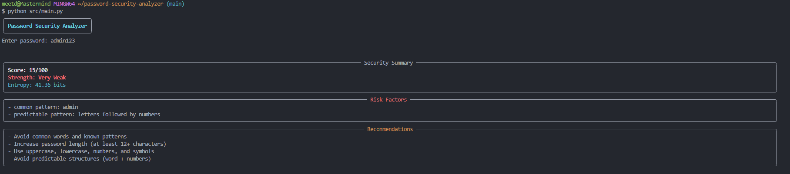
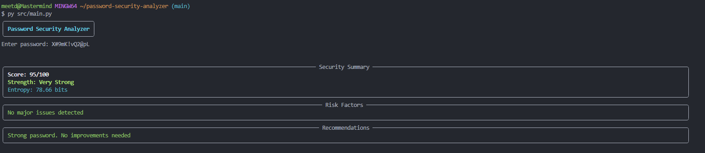

# 🔐 Password Security Analyzer

A behavior-based password strength analysis tool that evaluates password security using entropy estimation, structural pattern detection, and real-world weak password heuristics.

It simulates how attackers think by identifying predictable human password behaviors rather than relying only on simple dictionary checks.

---

## 🚀 Features

- 📊 Entropy-based password strength estimation
- 🧠 Detection of weak patterns (common passwords, keyboard sequences, repeated characters)
- 🔁 Sequential pattern detection (e.g., abcd, 1234)
- 🏗️ Structure analysis (word + numbers, predictable formats)
- 🧾 Risk scoring system (0–100 scale)
- 💡 Smart security recommendations
- 🎨 Rich CLI output for better readability

---

## 🧠 How It Works

### 1. Entropy Analysis
Estimates randomness based on character set complexity and length.

### 2. Pattern Detection
Flags known weak patterns such as:
- Common passwords (admin, password)
- Keyboard patterns (qwerty, asdfgh)
- Sequential patterns (abcd, 1234)

### 3. Structure Analysis
Detects predictable formats like:
- Letters + numbers (Meet123)
- Word + symbol + numbers (Meet@123)

### 4. Scoring Engine
Final score is calculated based on:
- Length bonus
- Entropy contribution
- Pattern penalties

---

## 🖥️ Usage

```bash
python -m src.main
```

---

## 📊 Example Output

Score: 35/100  
Strength: Weak  
Entropy: 42.5 bits  

Risk Factors:
- common pattern: 123
- predictable pattern: word + symbol + numbers

Recommendations:
- Avoid predictable structures
- Use longer passwords with mixed characters

---

## 📸 Screenshots

### 🔴 Weak Password


### 🟢 Strong Password


## 🧪 Project Structure

src/
│
├── analyzer.py
├── main.py
│
requirements.txt
README.md
.gitignore

---

## 🎯 Why This Project Matters

This tool simulates attacker-style reasoning rather than simple dictionary checks, demonstrating real cybersecurity thinking.

---

## 🛠️ Tech Stack

- Python
- Regex
- Math (Entropy)
- Rich CLI

---

## 👤 Author

Cybersecurity portfolio project focused on password analysis and attack pattern simulation.
